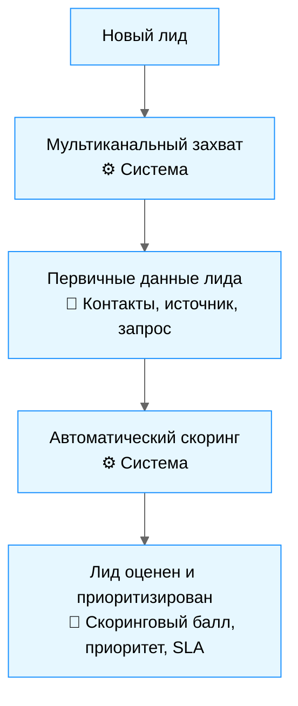
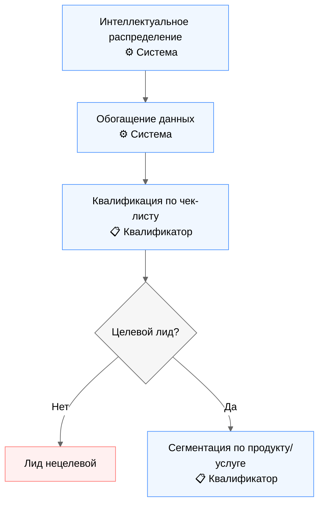
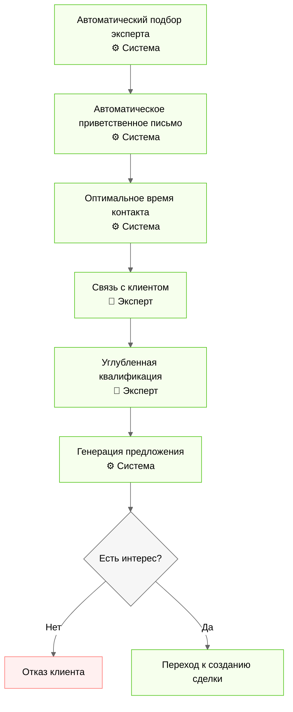
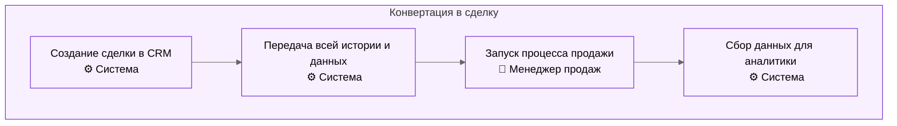

# Оптимизированный процесс обработки лидов

## Оглавление
- [Введение](#введение)
- [Общая схема процесса](#общая-схема-процесса)
- [1. Захват и регистрация лида](#1-захват-и-регистрация-лида)
  - [1.1 Мультиканальный захват](#11-мультиканальный-захват)
  - [1.2 Первичные данные лида](#12-первичные-данные-лида)
  - [1.3 Автоматический скоринг](#13-автоматический-скоринг)
  - [1.4 Лид оценен и приоритизирован](#14-лид-оценен-и-приоритизирован)
- [2. Квалификация лида](#2-квалификация-лида)
  - [2.1 Интеллектуальное распределение](#21-интеллектуальное-распределение)
  - [2.2 Обогащение данных](#22-обогащение-данных)
  - [2.3 Квалификация по чек-листу](#23-квалификация-по-чек-листу)
  - [2.4 Определение целевого характера](#24-определение-целевого-характера)
  - [2.5 Сегментация по продукту/услуге](#25-сегментация-по-продуктуслуге)
- [3. Обработка лида](#3-обработка-лида)
  - [3.1 Автоматический подбор эксперта](#31-автоматический-подбор-эксперта)
  - [3.2 Автоматическое приветственное письмо](#32-автоматическое-приветственное-письмо)
  - [3.3 Оптимальное время контакта](#33-оптимальное-время-контакта)
  - [3.4 Связь с клиентом](#34-связь-с-клиентом)
  - [3.5 Углубленная квалификация](#35-углубленная-квалификация)
  - [3.6 Генерация предложения](#36-генерация-предложения)
  - [3.7 Определение интереса клиента](#37-определение-интереса-клиента)
- [4. Конвертация в сделку](#4-конвертация-в-сделку)
  - [4.1 Создание сделки в CRM](#41-создание-сделки-в-crm)
  - [4.2 Передача истории и данных](#42-передача-истории-и-данных)
  - [4.3 Запуск процесса продажи](#43-запуск-процесса-продажи)
  - [4.4 Сбор данных для аналитики](#44-сбор-данных-для-аналитики)
- [Заключение](#заключение)
- [Глоссарий](#глоссарий)

## Введение

Этот документ описывает модернизированный процесс обработки лидов, направленный на максимальную автоматизацию рутинных операций, повышение скорости обработки и увеличение конверсии. Процесс включает четыре основных этапа: захват и регистрацию лида, квалификацию, обработку, и конвертацию в сделку.

## Общая схема процесса

```mermaid
%%{init: {
  'theme': 'neutral',
  'themeVariables': {
    'primaryColor': '#f4f4f4',
    'primaryTextColor': '#333',
    'primaryBorderColor': '#ddd',
    'lineColor': '#666',
    'secondaryColor': '#f0f7ff',
    'tertiaryColor': '#fff'
  }
}}%%
flowchart TD
 subgraph capture["Захват и регистрация лида"]
    newLead["Новый лид"] --> multiChannel["Мультиканальный захват
    ⚙️ Система
    (API-интеграции, сбор из всех каналов)"]
    
    multiChannel --> initialData["Первичные данные лида
    📄 Контакты, источник, запрос"]
    
    initialData --> autoScoring["Автоматический скоринг
    ⚙️ Система
    (оценка полноты данных, вес источника)"]
    
    autoScoring --> leadScore["Лид оценен и приоритизирован
    🔢 Скоринговый балл, приоритет, SLA"]
 end
 
 subgraph qualification["Квалификация лида"]
    leadDistribution["Интеллектуальное распределение
    ⚙️ Система
    (учет загрузки, компетенций)"] 
    
    dataEnrichment["Обогащение данных
    ⚙️ Система
    (проверка юр.лица, история)"]
    
    qualificationCheck["Квалификация по чек-листу
    📋 Квалификатор
    (потребности, бюджет, сроки)"]
    
    leadVerdict{"Целевой лид?
    (соответствие профилю)"}
    
    notTarget["Лид нецелевой
    ❌ Причины отказа"]
    
    targetSegmentation["Сегментация по продукту/услуге
    📋 Квалификатор
    (подбор решения)"]
 end
 
 subgraph processing["Обработка лида"]
    expertAssignment["Автоматический подбор эксперта
    ⚙️ Система
    (по продукту, загрузке)"]
    
    welcomeMessage["Автоматическое приветственное письмо
    ⚙️ Система
    (персонализация, материалы)"]
    
    scheduleContact["Оптимальное время контакта
    ⚙️ Система
    (анализ активности)"]
    
    expertContact["Связь с клиентом
    👤 Эксперт
    (установление контакта)"]
    
    deepQualification["Углубленная квалификация
    👤 Эксперт
    (детализация требований)"]
    
    proposalGeneration["Генерация предложения
    ⚙️ Система
    (персонализация КП)"]
    
    clientFeedback{"Есть интерес?
    (оценка реакции)"}
    
    rejection["Отказ клиента
    📝 Причины, обратная связь"]
 end
 
 subgraph conversion["Конвертация в сделку"]
    dealCreation["Создание сделки в CRM
    ⚙️ Система
    (тип сделки, стадия)"]
    
    dataTransfer["Передача всей истории и данных
    ⚙️ Система
    (коммуникации, потребности)"]
    
    salesProcess["Запуск процесса продажи
    👤 Менеджер продаж
    (план работы, контрольные точки)"]
    
    analyticsCollection["Сбор данных для аналитики
    ⚙️ Система
    (метрики, KPI, прогнозы)"]
 end

 %% Соединения между блоками и этапами
 leadScore --> leadDistribution
 leadDistribution --> dataEnrichment
 dataEnrichment --> qualificationCheck
 qualificationCheck --> leadVerdict
 leadVerdict -- "Нет" --> notTarget
 leadVerdict -- "Да" --> targetSegmentation
 targetSegmentation --> expertAssignment
 expertAssignment --> welcomeMessage
 welcomeMessage --> scheduleContact
 scheduleContact --> expertContact
 expertContact --> deepQualification
 deepQualification --> proposalGeneration
 proposalGeneration --> clientFeedback
 clientFeedback -- "Нет" --> rejection
 clientFeedback -- "Да" --> dealCreation
 dealCreation --> dataTransfer
 dataTransfer --> salesProcess
 salesProcess --> analyticsCollection
 
 %% Аналитические соединения
 rejection --> analyticsCollection
 notTarget --> analyticsCollection
 
 %% Стили для блоков
 style capture fill:#e6f7ff,stroke:#1890ff,stroke-width:1px
 style qualification fill:#f0f7ff,stroke:#4d94ff,stroke-width:1px
 style processing fill:#f6ffed,stroke:#52c41a,stroke-width:1px
 style conversion fill:#f9f0ff,stroke:#722ed1,stroke-width:1px
 
 %% Стили для элементов
 style newLead fill:#e6f7ff,stroke:#1890ff,stroke-width:1px
 style multiChannel fill:#e6f7ff,stroke:#1890ff,stroke-width:1px
 style initialData fill:#e6f7ff,stroke:#1890ff,stroke-width:1px
 style autoScoring fill:#e6f7ff,stroke:#1890ff,stroke-width:1px
 style leadScore fill:#e6f7ff,stroke:#1890ff,stroke-width:1px
 
 style leadDistribution fill:#f0f7ff,stroke:#4d94ff,stroke-width:1px
 style dataEnrichment fill:#f0f7ff,stroke:#4d94ff,stroke-width:1px
 style qualificationCheck fill:#f0f7ff,stroke:#4d94ff,stroke-width:1px
 style leadVerdict fill:#f6f6f6,stroke:#666,stroke-width:1px
 style notTarget fill:#fff0f0,stroke:#ff7875,stroke-width:1px
 style targetSegmentation fill:#f0f7ff,stroke:#4d94ff,stroke-width:1px
 
 style expertAssignment fill:#f6ffed,stroke:#52c41a,stroke-width:1px
 style welcomeMessage fill:#f6ffed,stroke:#52c41a,stroke-width:1px
 style scheduleContact fill:#f6ffed,stroke:#52c41a,stroke-width:1px
 style expertContact fill:#f6ffed,stroke:#52c41a,stroke-width:1px
 style deepQualification fill:#f6ffed,stroke:#52c41a,stroke-width:1px
 style proposalGeneration fill:#f6ffed,stroke:#52c41a,stroke-width:1px
 style clientFeedback fill:#f6f6f6,stroke:#666,stroke-width:1px
 style rejection fill:#fff0f0,stroke:#ff7875,stroke-width:1px
 
 style dealCreation fill:#f9f0ff,stroke:#722ed1,stroke-width:1px
 style dataTransfer fill:#f9f0ff,stroke:#722ed1,stroke-width:1px
 style salesProcess fill:#f9f0ff,stroke:#722ed1,stroke-width:1px
 style analyticsCollection fill:#f9f0ff,stroke:#722ed1,stroke-width:1px
```

## 1. Захват и регистрация лида

### Обзор этапа
Этап предназначен для автоматического сбора лидов из всех каналов коммуникации с последующей их оценкой и приоритизацией.

### Схема этапа

### 1.1 Мультиканальный захват

**Описание**: Автоматический сбор лидов из всех возможных каналов коммуникации.

**Задачи**:
- Интеграция с телефонией (запись звонков, автоматическая фиксация входящих номеров)
- Подключение форм с сайта (через API или webhook)
- Мониторинг корпоративной почты с автоматическим парсингом писем
- Интеграция с мессенджерами (WhatsApp Business API, Telegram Bot API)
- Обработка заявок из маркетплейсов (Авито, Яндекс.Услуги)

**Способы выполнения**:
- Настройка API-интеграций для каждого канала
- Внедрение единого шлюза для агрегации данных из разных источников
- Использование единого формата данных для стандартизации поступающей информации

### 1.2 Первичные данные лида

**Описание**: Фиксация базовой информации о потенциальном клиенте.

**Задачи**:
- Сохранение контактных данных (телефон, email, мессенджеры)
- Фиксация первичного запроса или интереса
- Сохранение информации об источнике (канал, кампания, UTM-метки)
- Запись времени обращения и технических параметров (устройство, геолокация)

**Способы выполнения**:
- Автоматическое создание карточки лида в CRM
- Структурированное хранение данных в полях соответствующих типов
- Использование регулярных выражений для валидации контактных данных

### 1.3 Автоматический скоринг

**Описание**: Алгоритмическая оценка качества и потенциальной ценности лида.

**Задачи**:
- Оценка полноты предоставленных данных
- Анализ источника обращения и его конверсионной ценности
- Проверка повторных обращений и истории взаимодействия
- Расчет вероятности конверсии на основе предиктивных моделей

**Способы выполнения**:
- Использование взвешенной скоринговой модели с настраиваемыми коэффициентами
- Применение ML-алгоритмов для динамической корректировки весов факторов
- Использование исторических данных о конверсии для калибровки модели

### 1.4 Лид оценен и приоритизирован

**Описание**: Результат скоринга с присвоением приоритета для дальнейшей обработки.

**Задачи**:
- Присвоение скорингового балла (например, от 0 до 100)
- Определение категории лида (горячий, теплый, холодный)
- Установка приоритета обработки (высокий, средний, низкий)
- Фиксация срока SLA для первой реакции

**Способы выполнения**:
- Автоматическое присвоение тегов на основе скорингового балла
- Визуальная маркировка лидов в интерфейсе системы
- Настройка правил сортировки и отображения в очереди обработки

## 2. Квалификация лида

### Обзор этапа
Этап квалификации предназначен для определения ценности лида и его соответствия профилю компании, включая оценку потребностей, бюджета и сроков. На этом этапе происходит разделение лидов на целевые и нецелевые.

### Схема этапа

### 2.1 Интеллектуальное распределение

**Описание**: Автоматический подбор оптимального сотрудника для квалификации лида.

**Задачи**:
- Анализ текущей загрузки квалификаторов
- Учет специализации сотрудников по продуктам/услугам
- Учет исторической эффективности сотрудников с разными типами лидов
- Соблюдение балансировки нагрузки в команде

**Способы выполнения**:
- Использование алгоритма распределения с учетом весовых коэффициентов
- Автоматическое создание задачи для выбранного сотрудника
- Система оповещений через браузер/приложение/email

### 2.2 Обогащение данных

**Описание**: Автоматическое дополнение карточки лида информацией из внешних источников.

**Задачи**:
- Проверка юридического лица по ИНН/ОГРН
- Поиск профилей в социальных сетях
- Анализ сайта компании (при наличии)
- Проверка по базам данных недобросовестных контрагентов
- Сбор информации о предыдущих взаимодействиях с компанией

**Способы выполнения**:
- Интеграция с сервисами проверки контрагентов (DaData, Контур.Фокус)
- Использование API социальных сетей для поиска профилей
- Применение алгоритмов веб-скрапинга для анализа сайтов

### 2.3 Квалификация по чек-листу

**Описание**: Структурированный процесс определения потребностей и соответствия клиента.

**Задачи**:
- Подтверждение контактных данных
- Определение потребностей и болей клиента
- Выяснение бюджета и сроков
- Определение полномочий принятия решений
- Выявление конкурентной ситуации

**Способы выполнения**:
- Использование интерактивного чек-листа с подсказками
- Система напоминаний о незаполненных ключевых полях
- Автоматическое предложение скриптов разговора

### 2.4 Определение целевого характера

**Описание**: Принятие решения о целесообразности дальнейшей работы с лидом.

**Задачи**:
- Оценка соответствия продуктовому портфелю компании
- Анализ возможности удовлетворения запроса
- Проверка соответствия география, объема, сроков
- Расчет потенциальной прибыльности работы с клиентом

**Способы выполнения**:
- Применение критериев отсечения по ключевым параметрам
- Использование матрицы принятия решений
- Автоматические подсказки на основе анализа данных

### 2.5 Сегментация по продукту/услуге

**Описание**: Определение конкретного продукта/услуги, соответствующего потребностям клиента.

**Задачи**:
- Сопоставление выявленных потребностей с продуктовым портфелем
- Выбор оптимального продукта/комбинации услуг
- Определение потенциальных дополнительных продуктов (upsell/cross-sell)
- Подготовка к передаче профильному специалисту

**Способы выполнения**:
- Использование дерева решений для подбора продукта
- Система рекомендаций на основе исторических данных
- Автоматическое тегирование лида по выбранным продуктам/услугам

## 3. Обработка лида

### Обзор этапа
Этап обработки лида включает в себя работу эксперта по углубленной квалификации потребностей клиента, презентацию решения и определение заинтересованности. На этом этапе происходит превращение квалифицированного лида в потенциальную сделку.

### Схема этапа

### 3.1 Автоматический подбор эксперта

**Описание**: Определение оптимального специалиста для работы с квалифицированным лидом.

**Задачи**:
- Поиск эксперта по выбранному продукту/услуге
- Учет текущей загрузки экспертов
- Анализ исторической эффективности с похожими типами клиентов
- Соблюдение правил распределения и балансировки

**Способы выполнения**:
- Алгоритм подбора с учетом матрицы компетенций
- Система резервирования при отсутствии доступных экспертов
- Автоматическое уведомление выбранного эксперта

### 3.2 Автоматическое приветственное письмо

**Описание**: Подготовка и отправка персонализированного сообщения клиенту.

**Задачи**:
- Информирование о получении запроса
- Представление назначенного эксперта
- Предоставление предварительной информации по запросу
- Установка ожиданий по следующим шагам

**Способы выполнения**:
- Использование динамических шаблонов с персонализацией
- Адаптация тона и содержания под сегмент клиента
- Включение релевантных материалов (брошюры, case-studies)
- Отслеживание открытия и реакции на письмо

### 3.3 Оптимальное время контакта

**Описание**: Определение наилучшего времени для связи с клиентом.

**Задачи**:
- Анализ предпочтений клиента (если известны)
- Учет часового пояса и рабочих часов
- Анализ статистики успешных контактов
- Планирование контакта с учетом загрузки эксперта

**Способы выполнения**:
- Использование предиктивных моделей для определения оптимального времени
- Автоматическое создание задачи в календаре эксперта
- Система уведомлений и напоминаний

### 3.4 Связь с клиентом

**Описание**: Установление контакта с лидом экспертом по продукту.

**Задачи**:
- Установление рапорта и доверия
- Подтверждение первичной информации
- Презентация релевантных возможностей решения
- Ответы на первичные вопросы и возражения

**Способы выполнения**:
- Предпочтительный канал связи (телефон, видеозвонок, мессенджер)
- Использование подготовленных скриптов с ключевыми сообщениями
- Запись разговора с автоматической расшифровкой
- Система подсказок во время разговора

### 3.5 Углубленная квалификация

**Описание**: Детальное выяснение потребностей и требований клиента.

**Задачи**:
- Проведение глубинного анализа проблемы/потребности
- Выявление скрытых ограничений и требований
- Определение критериев успеха для клиента
- Установление временных рамок и этапов проекта
- Подтверждение бюджетных ожиданий

**Способы выполнения**:
- Использование специализированных опросников по продукту
- Методика "лестницы вопросов" для выявления глубинных мотивов
- Документирование всех требований в структурированной форме
- Визуализация понимания потребности (схемы, диаграммы)

### 3.6 Генерация предложения

**Описание**: Автоматическое создание персонализированного коммерческого предложения.

**Задачи**:
- Подбор оптимальной конфигурации продукта/услуги
- Расчет стоимости с учетом особенностей запроса
- Подготовка персонализированного КП в фирменном стиле
- Включение кейсов и отзывов релевантных клиенту

**Способы выполнения**:
- Использование системы автоматизированного формирования КП
- Динамическое формирование контента на основе собранных данных
- Интеграция с библиотекой кейсов и референсов
- Автоматическое согласование предложения при выходе за рамки стандартных условий

### 3.7 Определение интереса клиента

**Описание**: Выяснение реакции клиента на предложение и готовности к следующим шагам.

**Задачи**:
- Презентация подготовленного предложения
- Работа с возражениями и вопросами
- Оценка уровня заинтересованности
- Определение временных рамок принятия решения
- Фиксация отказа или перевод в статус потенциальной сделки

**Способы выполнения**:
- Система оценки реакции по ключевым индикаторам
- Методика SPIN-продаж для выявления истинного интереса
- Тактики закрытия для получения четкого ответа
- Документирование всех вопросов и возражений для дальнейшего использования

## 4. Конвертация в сделку

### Обзор этапа
Заключительный этап процесса обработки лида, направленный на преобразование положительной заинтересованности клиента в полноценную сделку в CRM и запуск процесса продажи.

### Схема этапа

### 4.1 Создание сделки в CRM

**Описание**: Формирование полноценной сделки из квалифицированного лида.

**Задачи**:
- Выбор правильного типа сделки
- Определение стадии в воронке продаж
- Назначение ответственного менеджера
- Установка ключевых дат и контрольных точек

**Способы выполнения**:
- Автоматическое создание карточки сделки с предзаполненными полями
- Настройка уведомлений для вовлеченных сторон
- Создание задач для следующих шагов

### 4.2 Передача истории и данных

**Описание**: Обеспечение доступа к полной информации о взаимодействии с клиентом.

**Задачи**:
- Консолидация всех коммуникаций (звонки, email, сообщения)
- Передача результатов квалификации и выявленных потребностей
- Предоставление доступа к истории изменений и действий
- Сохранение инсайтов и неочевидных деталей

**Способы выполнения**:
- Формирование единого профиля клиента с хронологией взаимодействий
- Использование тегов и атрибутов для выделения ключевой информации
- Автоматическое создание дайджеста истории взаимодействия

### 4.3 Запуск процесса продажи

**Описание**: Инициация работы менеджера продаж с подготовленной сделкой.

**Задачи**:
- Ознакомление с историей и потребностями клиента
- Подготовка к первому контакту
- Составление плана работы со сделкой
- Настройка этапов и контрольных точек

**Способы выполнения**:
- Использование стандартизированного процесса работы со сделкой
- Система автоматических подсказок и рекомендаций
- Календарное планирование активностей
- Настройка триггеров для автоматических действий

### 4.4 Сбор данных для аналитики

**Описание**: Агрегация информации для анализа и улучшения процесса.

**Задачи**:
- Сбор метрик на каждом этапе воронки
- Фиксация времени прохождения этапов
- Отслеживание ключевых показателей эффективности
- Подготовка данных для управленческих отчетов
- Анализ конверсии по источникам и типам лидов

**Способы выполнения**:
- Интеграция с аналитической системой (BI)
- Автоматическое формирование дашбордов в реальном времени
- Настройка алертов при отклонении показателей от нормы
- Периодическая рассылка аналитических сводок ключевым лицам

## Заключение

Представленный оптимизированный процесс обработки лидов предоставляет следующие преимущества:

1. **Автоматизация рутинных задач**
   - Сокращение времени на ручную обработку информации
   - Минимизация человеческих ошибок
   - Высвобождение ресурсов для работы с ключевыми клиентами

2. **Повышение скорости реакции**
   - Мгновенная фиксация лидов из всех каналов
   - Автоматическое распределение по приоритету
   - Соблюдение SLA на всех этапах

3. **Улучшение качества работы с клиентами**
   - Персонализированный подход на основе данных
   - Единая история взаимодействия
   - Предиктивные рекомендации для экспертов

4. **Увеличение конверсии**
   - Сокращение потерь лидов между этапами
   - Целевое распределение ресурсов на основе скоринга
   - Оптимизация времени контакта

5. **Аналитические возможности**
   - Полная прозрачность процесса
   - Возможность A/B-тестирования подходов
   - Предиктивные модели эффективности

Внедрение данного процесса рекомендуется проводить поэтапно, начиная с автоматизации захвата и скоринга лидов, с последующим расширением на остальные этапы. Это позволит постепенно адаптировать персонал к новым методам работы и своевременно корректировать настройки системы.

## Глоссарий

**Лид** - потенциальный клиент, проявивший интерес к продуктам или услугам компании.

**Скоринг** - оценка потенциального клиента на основе различных параметров для определения вероятности его конверсии в покупателя.

**SLA (Service Level Agreement)** - заранее определенное время, в течение которого должна произойти реакция на лида или выполнены определенные действия по его обработке.

**Квалификация лида** - процесс оценки потенциального клиента для определения его соответствия целевой аудитории компании.

**BANT** - методология квалификации лидов, включающая оценку бюджета (Budget), полномочий (Authority), потребности (Need) и временных рамок (Timeline).

**Конверсия** - переход лида из одной стадии воронки продаж в другую, завершающийся покупкой или отказом.

**Воронка продаж** - визуальное представление процесса продажи, отражающее последовательные этапы взаимодействия с клиентом от первого контакта до заключения сделки.

**API (Application Programming Interface)** - набор определений, протоколов и инструментов для интеграции программных приложений.

**Webhook** - метод автоматической передачи данных между веб-приложениями в режиме реального времени.

**BI (Business Intelligence)** - методы и инструменты для преобразования необработанных данных в осмысленную информацию для бизнес-анализа.

**ML (Machine Learning)** - использование алгоритмов, которые автоматически улучшаются через опыт, применяемое для предсказания качества лидов и оптимальных действий.
