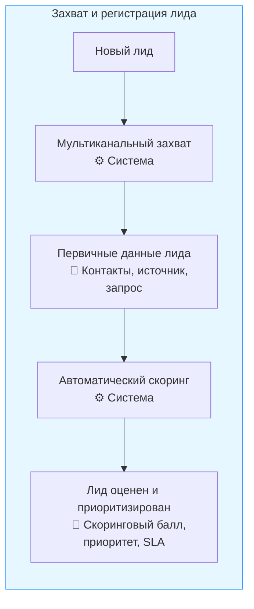

# Оптимизированный процесс обработки лидов

## Оглавление
- [Введение](#введение)
- [Общая схема процесса](#общая-схема-процесса)
- [1. Захват и регистрация лида](#1-захват-и-регистрация-лида)
  - [1.1 Мультиканальный захват](#11-мультиканальный-захват)
  - [1.2 Первичные данные лида](#12-первичные-данные-лида)
  - [1.3 Автоматический скоринг](#13-автоматический-скоринг)
  - [1.4 Лид оценен и приоритизирован](#14-лид-оценен-и-приоритизирован)
- [2. Квалификация лида](#2-квалификация-лида)
- [3. Обработка лида](#3-обработка-лида)
- [4. Конвертация в сделку](#4-конвертация-в-сделку)
- [Заключение](#заключение)
- [Глоссарий](#глоссарий)

## Введение

Этот документ описывает модернизированный процесс обработки лидов, направленный на максимальную автоматизацию рутинных операций, повышение скорости обработки и увеличение конверсии. Процесс включает четыре основных этапа: захват и регистрацию лида, квалификацию, обработку, и конвертацию в сделку.

## Общая схема процесса

```mermaid
flowchart LR
 subgraph capture["Захват и регистрация лида"]
    newLead["Новый лид"] --> multiChannel["Мультиканальный захват
    ⚙️ Система
    (API-интеграции, сбор из всех каналов)"]
    
    multiChannel --> initialData["Первичные данные лида
    📄 Контакты, источник, запрос"]
    
    initialData --> autoScoring["Автоматический скоринг
    ⚙️ Система
    (оценка полноты данных, вес источника)"]
    
    autoScoring --> leadScore["Лид оценен и приоритизирован
    🔢 Скоринговый балл, приоритет, SLA"]
 end
 
 subgraph qualification["Квалификация лида"]
    leadDistribution["Интеллектуальное распределение
    ⚙️ Система"] 
    
    dataEnrichment["Обогащение данных
    ⚙️ Система"]
    
    qualificationCheck["Квалификация по чек-листу
    📋 Квалификатор"]
    
    leadVerdict{"Целевой лид?"}
    
    notTarget["Лид нецелевой"]
    
    targetSegmentation["Сегментация по продукту/услуге
    📋 Квалификатор"]
 end
 
 subgraph processing["Обработка лида"]
    expertAssignment["Автоматический подбор эксперта
    ⚙️ Система"]
    
    clientFeedback{"Есть интерес?"}
    
    rejection["Отказ клиента"]
 end
 
 subgraph conversion["Конвертация в сделку"]
    dealCreation["Создание сделки в CRM
    ⚙️ Система"]
    
    analyticsCollection["Сбор данных для аналитики
    ⚙️ Система"]
 end

 leadScore --> leadDistribution
 leadDistribution --> dataEnrichment
 dataEnrichment --> qualificationCheck
 qualificationCheck --> leadVerdict
 leadVerdict -- "Нет" --> notTarget
 leadVerdict -- "Да" --> targetSegmentation
 targetSegmentation --> expertAssignment
 expertAssignment --> clientFeedback
 clientFeedback -- "Нет" --> rejection
 clientFeedback -- "Да" --> dealCreation
 dealCreation --> analyticsCollection
 rejection --> analyticsCollection
 notTarget --> analyticsCollection
 
 %% Стили для блоков
 classDef captureBlock fill:#e6f7ff,stroke:#1890ff
 classDef qualificationBlock fill:#f6ffed,stroke:#52c41a
 classDef processingBlock fill:#fff2e8,stroke:#fa8c16
 classDef conversionBlock fill:#f9f0ff,stroke:#722ed1
 
 %% Применение стилей
 capture:::captureBlock
 qualification:::qualificationBlock
 processing:::processingBlock
 conversion:::conversionBlock
```

## 1. Захват и регистрация лида

### Обзор этапа
Этап предназначен для автоматического сбора лидов из всех каналов коммуникации с последующей их оценкой и приоритизацией.

### Схема этапа

### 1.1 Мультиканальный захват

**Описание**: Автоматический сбор лидов из всех возможных каналов коммуникации.

**Задачи**:
- Интеграция с телефонией (запись звонков, автоматическая фиксация входящих номеров)
- Подключение форм с сайта (через API или webhook)
- Мониторинг корпоративной почты с автоматическим парсингом писем
- Интеграция с мессенджерами (WhatsApp Business API, Telegram Bot API)
- Обработка заявок из маркетплейсов (Авито, Яндекс.Услуги)

**Способы выполнения**:
- Настройка API-интеграций для каждого канала
- Внедрение единого шлюза для агрегации данных из разных источников
- Использование единого формата данных для стандартизации поступающей информации

### 1.2 Первичные данные лида

**Описание**: Фиксация базовой информации о потенциальном клиенте.

**Задачи**:
- Сохранение контактных данных (телефон, email, мессенджеры)
- Фиксация первичного запроса или интереса
- Сохранение информации об источнике (канал, кампания, UTM-метки)
- Запись времени обращения и технических параметров (устройство, геолокация)

**Способы выполнения**:
- Автоматическое создание карточки лида в CRM
- Структурированное хранение данных в полях соответствующих типов
- Использование регулярных выражений для валидации контактных данных

### 1.3 Автоматический скоринг

**Описание**: Алгоритмическая оценка качества и потенциальной ценности лида.

**Задачи**:
- Оценка полноты предоставленных данных
- Анализ источника обращения и его конверсионной ценности
- Проверка повторных обращений и истории взаимодействия
- Расчет вероятности конверсии на основе предиктивных моделей

**Способы выполнения**:
- Использование взвешенной скоринговой модели с настраиваемыми коэффициентами
- Применение ML-алгоритмов для динамической корректировки весов факторов
- Использование исторических данных о конверсии для калибровки модели

### 1.4 Лид оценен и приоритизирован

**Описание**: Результат скоринга с присвоением приоритета для дальнейшей обработки.

**Задачи**:
- Присвоение скорингового балла (например, от 0 до 100)
- Определение категории лида (горячий, теплый, холодный)
- Установка приоритета обработки (высокий, средний, низкий)
- Фиксация срока SLA для первой реакции

**Способы выполнения**:
- Автоматическое присвоение тегов на основе скорингового балла
- Визуальная маркировка лидов в интерфейсе системы
- Настройка правил сортировки и отображения в очереди обработки

## 2. Квалификация лида

### Обзор этапа
*Здесь будет описание следующего этапа...*

## Глоссарий

**Лид** - потенциальный клиент, проявивший интерес к продуктам или услугам компании.

**Скоринг** - оценка потенциального клиента на основе различных параметров для определения вероятности его конверсии в покупателя.

**SLA (Service Level Agreement)** - заранее определенное время, в течение которого должна произойти реакция на лида или выполнены определенные действия по его обработке.

**Квалификация лида** - процесс оценки потенциального клиента для определения его соответствия целевой аудитории компании.

**Конверсия** - переход лида из одной стадии воронки продаж в другую, завершающийся покупкой или отказом.